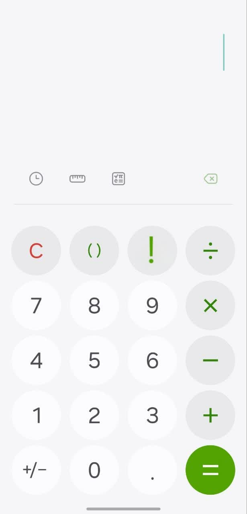
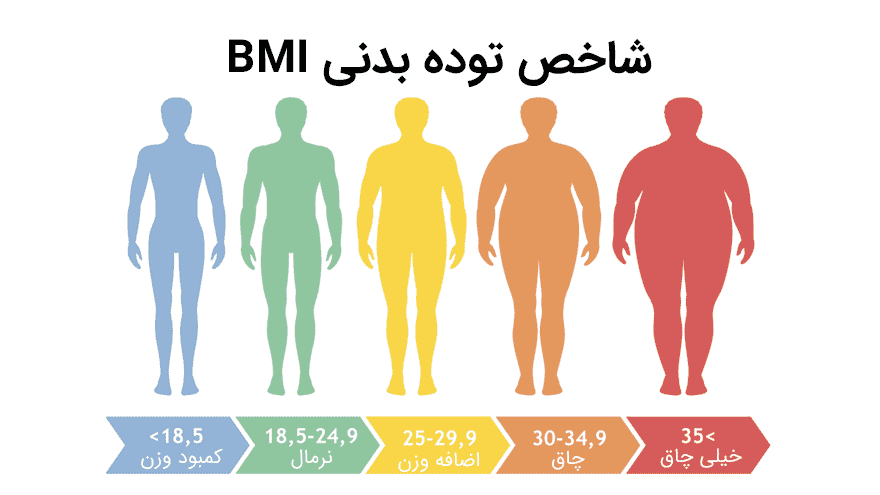

# Assignment1

## Create a simple calculator (part1)
In this simple calculator we put 4 operation, basic trigonometry, square root and factorail function

---
## Create a Triangle (part2)
In this code, we used this mathematical theorem:
In any triangle, the size of each side is smaller than the sum of the other two sides

---

## Grade point average (part3)
## BMI (part4)
In this part, it calculates the body mass index and announces the result

